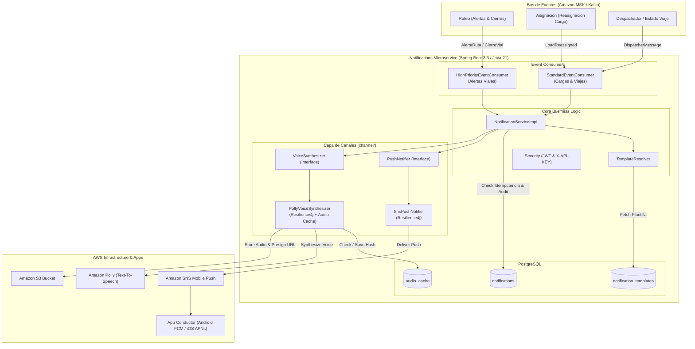
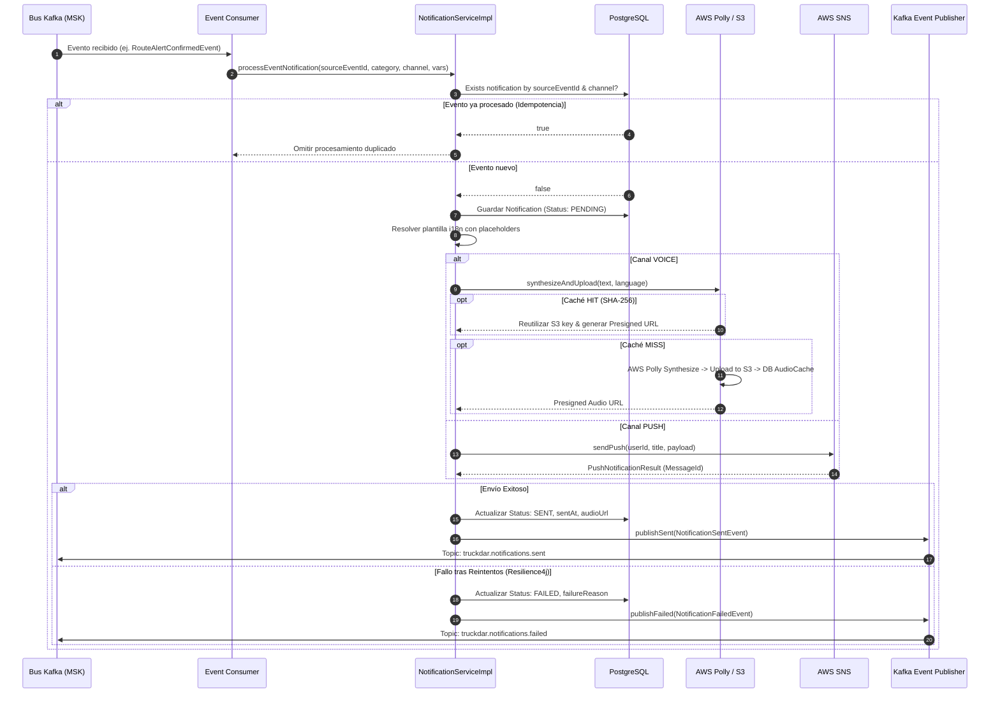

# TruckDar - Microservicio Notifications

Microservicio responsable de la entrega confiable y auditable de notificaciones para la plataforma **TruckDar** (navegación y comunidad para transporte de carga pesada en Colombia).

Distribuye notificaciones a los conductores y coordinadores a través de dos canales:
1. **Push Notifications (Texto):** Hacia la app móvil (Android FCM / iOS APNs) y panel web del coordinador — integrado mediante **Amazon SNS Mobile Push**.
2. **Voz (Text-To-Speech):** Alertas audibles para conductores mientras manejan sin apartar la vista de la vía — integrado con **Amazon Polly** (síntesis de voz) y **Amazon S3** (almacenamiento de audio y URLs firmadas temporales).

---

## 📐 Diagrama de Arquitectura de Componentes



---

## 🔄 Diagrama de Flujo de Procesamiento e Idempotencia



---

## 🏗️ Arquitectura y Principios de Diseño

- **Desacoplamiento del Dominio:** Este microservicio no decide *qué* ni *cuándo* notificar; es un consumidor de eventos de dominio publicados en el bus (Amazon MSK / Kafka) por los demás servicios (`Asignación`, `Ruteo`, `Alertas y Comunidad`).
- **Abstracción de Canales (`channel/`):** La lógica de negocio depende exclusivamente de interfaces (`PushNotifier`, `VoiceSynthesizer`), desacoplada de los SDKs de AWS para facilitar pruebas y sustitución de proveedores.
- **Priorización por Canal:** Los eventos críticos para la seguridad vial (`ALERTA_RUTA`, `CIERRE_VIAL`) se procesan en un listener de Kafka dedicado con mayor nivel de concurrencia y prioridad inmediata (`HighPriorityEventConsumer`).
- **Caché Inteligente de Audio:** Se computa un hash SHA-256 del texto, voz e idioma. Si una alerta frecuente ya fue sintetizada recientemente (ej. báscula activa o derrumbe repetitivo para varios conductores en el mismo tramo), se reutiliza el archivo en S3 evitando llamadas redundantes a Polly (ahorro significativo de costo y latencia).
- **Idempotencia Garantizada:** Todo evento procesado valida contra la tabla `notifications` utilizando `sourceEventId` y `channel`. Si un mensaje es reentregado por Kafka, se descarta sin duplicar envíos.
- **Resiliencia:** Retry con backoff exponencial (máx 3 intentos) y Circuit Breaker mediante **Resilience4j** en las invocaciones a SNS y Polly. Si se agotan los reintentos, se marca `FAILED` y se publica `NotificationFailedEvent`.

---

## 📦 Estructura del Proyecto

```text
com.truckdar.notifications
├── channel/
│   ├── PushNotifier.java                  # Interfaz de envío Push
│   ├── VoiceSynthesizer.java              # Interfaz de síntesis de voz
│   ├── push/
│   │   ├── PushNotificationResult.java
│   │   └── SnsPushNotifier.java           # Cliente AWS SNS con @Retry y @CircuitBreaker
│   └── voice/
│       ├── VoiceSynthesisResult.java
│       └── PollyVoiceSynthesizer.java     # Cliente AWS Polly + S3 + Caché
├── config/
│   ├── AwsConfig.java                     # Beans AWS SDK v2 con soporte LocalStack
│   ├── KafkaConfig.java                   # Consumer/Producer config, DLT y contenedores prioritarios
│   ├── OpenApiConfig.java                 # OpenAPI 3.0 con Bearer JWT y X-API-KEY
│   └── SecurityConfig.java                # Spring Security stateless filter chain
├── controller/
│   ├── NotificationController.java        # Envío directo (API Key) e historial/detalle (JWT)
│   └── NotificationTemplateController.java# Gestión de plantillas i18n (ADMIN)
├── dto/
│   ├── request/                           # DirectNotificationSendRequest, TemplateUpdateRequest
│   └── response/                          # NotificationResponse, NotificationTemplateResponse
├── event/
│   ├── consumer/
│   │   ├── HighPriorityEventConsumer.java # Listener para ALERTA_RUTA y CIERRE_VIAL
│   │   └── StandardEventConsumer.java     # Listener para REASIGNACION, ESTADO y DESPACHADOR
│   ├── model/                             # Modelos de eventos consumidos y publicados
│   └── publisher/
│       └── NotificationEventPublisher.java# Publicador de NotificationSent / NotificationFailed
├── exception/
│   ├── GlobalExceptionHandler.java        # RFC 7807 ProblemDetail
│   ├── NotificationDeliveryException.java
│   └── ResourceNotFoundException.java
├── mapper/                                # Mappers MapStruct
├── model/                                 # Entidades JPA (Notification, NotificationTemplate, AudioCache)
├── repository/                            # Spring Data JPA Repositories
├── security/                              # Filtros de JWT y API Key
├── service/
│   ├── NotificationService.java
│   └── NotificationTemplateService.java
└── NotificationsApplication.java
```

---

## ⚡ Eventos de Dominio en Kafka

### Eventos Consumidos

| Evento | Tópico | Categoría | Canal | Prioridad |
|---|---|---|---|---|
| `LoadReassignedEvent` | `truckdar.loads.reassigned` | `REASIGNACION_CARGA` | `PUSH` | Estándar |
| `RouteAlertConfirmedEvent` | `truckdar.route.alerts` | `ALERTA_RUTA` | `VOICE` | **Alta (Seguridad Vial)** |
| `RoadClosureDetectedEvent` | `truckdar.route.closures` | `CIERRE_VIAL` | `VOICE` | **Alta (Seguridad Vial)** |
| `DispatcherMessageEvent` | `truckdar.dispatch.messages` | `MENSAJE_DESPACHADOR` | `PUSH` + `VOICE` | Estándar |
| `TripStatusChangedEvent` | `truckdar.trips.status` | `CAMBIO_ESTADO_VIAJE` | `PUSH` | Estándar |

### Eventos Publicados

- `NotificationSentEvent` (`truckdar.notifications.sent`): Emitido cuando una notificación se envía o sintetiza exitosamente.
- `NotificationFailedEvent` (`truckdar.notifications.failed`): Emitido cuando se agotan los reintentos tras fallo de entrega en el canal.

---

## 🌐 Endpoints REST

| Método | Ruta | Descripción | Autenticación |
|---|---|---|---|
| `POST` | `/api/v1/notifications/send` | Envío directo para casos excepcionales entre microservicios | Header `X-API-KEY` (`ROLE_INTERNAL_SERVICE`) |
| `GET` | `/api/v1/notifications/user/{userId}` | Historial paginado de notificaciones de un usuario | JWT Bearer (mismo usuario o `ADMIN`/`COORDINADOR`) |
| `GET` | `/api/v1/notifications/{id}` | Detalle puntual de una notificación | JWT Bearer (`ADMIN`, `COORDINADOR`) |
| `GET` | `/api/v1/templates` | Lista todas las plantillas configuradas | JWT Bearer (`ADMIN`) |
| `PUT` | `/api/v1/templates/{id}` | Edita el texto de una plantilla | JWT Bearer (`ADMIN`) |

- **Swagger UI:** `http://localhost:8083/swagger-ui.html`
- **OpenAPI JSON:** `http://localhost:8083/v3/api-docs`
- **Actuator Health:** `http://localhost:8083/actuator/health`

---

## 🚀 Puesta en Marcha Local

### 1. Requisitos
- **Java 21**
- **Docker** y **Docker Compose**

### 2. Levantar la Infraestructura Local (PostgreSQL, Kafka, LocalStack)
```bash
docker compose up -d postgres kafka zookeeper localstack
```

LocalStack se inicializa automáticamente creando:
- Bucket S3: `truckdar-voice-notifications`
- Tópico SNS: `truckdar-notifications`

### 3. Ejecutar la Aplicación
```bash
# Con Maven Wrapper usando perfil local
./mvnw spring-boot:run -Dspring-boot.run.profiles=local
```

### 4. Ejecutar con Docker Compose Completo
```bash
docker compose up --build
```

---

## 🧪 Pruebas Automatizadas

```bash
# Ejecutar suite de pruebas unitarias y de integración
./mvnw test
```